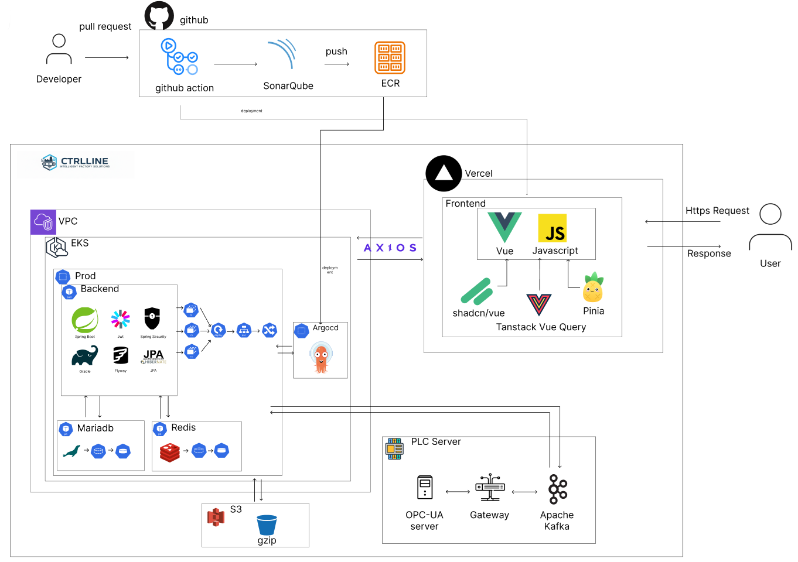
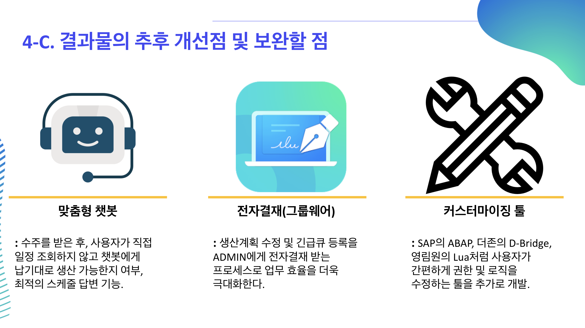

  

## 👥팀원

|                                                                                서현원                                                                                 |                                                                                김택곤                                                                                 |                                                                                육세윤                                                                                 |                                                                                 이인화                                                                                  |                                                                                 김대의                                                                                 |
| :-------------------------------------------------------------------------------------------------------------------------------------------------------------------: | :-------------------------------------------------------------------------------------------------------------------------------------------------------------------: | :-------------------------------------------------------------------------------------------------------------------------------------------------------------------: | :---------------------------------------------------------------------------------------------------------------------------------------------------------------------: | :--------------------------------------------------------------------------------------------------------------------------------------------------------------------: |
|                                                                                                                       |                                                                                                                       |                                                                                                                       |                                                                                                                         |                                                                                                                        |
|  |  |  |  |  |

## 📚 목차

1. [프로젝트 개요](#1-프로젝트-개요)
2. [프로젝트 기획서](#2-프로젝트-기획서)
3. [WBS](#3-wbs)
4. [요구사항 명세서](#4-요구사항-명세서)  
5. [기술 스택](#5-기술-스택)  
6. [시스템 아키텍처](#6-시스템-아키텍처)  
7. [데이터베이스 설계 (ERD)](#7-데이터베이스-설계-erd)  
8. [화면 기능 설계서](#8-화면-기능-설계서)
9. [테이블 명세서](#9-테이블-명세서)  
10. [API 명세서](#10-api-명세서)  
11. [테스트 결과서](#11-테스트-결과서)
12. [CI/CD 계획서](#12-cicd-계획서)
13. [통합 테스트 결과서](#13-통합-테스트-결과서)
14. [향후 개선 계획](#14-향후-개선-계획)
15. [회고록](#15-회고록)

 

##  1. 프로젝트 개요  
#### 1.1 프로젝트 소개
CtrlLine은 복잡한 생산 자원과 일정을 관리해야 하는 제조 환경을 대상으로 생산 계획과 일정을 Resource Scheduler View 기반의 직관적인 UI로 관리할 수 있도록 설계된 ERP–MES 통합형 생산 일정 관리 모듈입니다.

기존 MES 시스템의 텍스트 기반 일정 관리 방식에서 발생하는 입력 오류, 일정 충돌, 낮은 가독성 등의 문제를 개선하고자 사용자가 생산 일정을 한눈에 파악하고 직접 조정할 수 있는 환경을 제공하는 것을 목표로 합니다.

특히 다수의 사용자가 동시에 생산 계획을 입력·수정하는 상황에서도 일정 중복과 충돌을 사전에 방지하고 현장 작업자의 실수를 최소화하여 납기 준수율과 업무 효율을 함께 향상시키는 데 초점을 맞추었습니다.

#### 1.2 프로젝트 배경
스마트팩토리 도입이 확산되면서 제조업 현장에서는 ERP와 MES를 기반으로 한 생산 일정 관리의 중요성이 지속적으로 증가하고 있습니다. 그러나 실제 현장에서 사용되는 기존 MES 시스템은
대부분 텍스트 중심의 일정 입력 방식을 사용하고 있어, 생산 일정의 흐름을 직관적으로 파악하기 어렵다는 한계를 가지고 있습니다.

이로 인해 다음과 같은 문제가 반복적으로 발생했습니다.

- 생산 일정이 텍스트 형태로 나열되어 전체 흐름 파악이 어려움

- 일정 입력 및 수정 과정에서 오타·입력 실수 발생

- 납기 변경 시 일정 충돌이 발생해 납기 준수율 저하

- 다수 사용자가 동시에 작업할 경우 일정 중복 및 혼선 발생

특히 기존의 자동 스케줄링 방식은 납기일자 기준으로 일정을 등록하는 구조로 인해
일정 충돌 시 현장 담당자가 수동으로 조정해야 했고 이 과정에서 휴먼 에러와 커뮤니케이션 비용이 증가하는 문제가 있었습니다.

CtrlLine은 이러한 문제를 해결하기 위해 생산 자원과 일정을 시각적으로 표현하고 직접 조작할 수 있는 Scheduler UI를 도입하여 사용자가 일정을 “입력하는 시스템”이 아니라 “이해하고 판단할 수 있는 시스템”으로 전환하는 것을 목표로 기획되었습니다.

 

## 2. 프로젝트 기획서

[프로젝트 기획서](https://docs.google.com/document/d/1VOfl-v10xuCLpZuywdeU1bzYZpoQW2oC3x20mmyNN_4/edit?usp=sharing)

 

## 3. WBS
[WBS](https://docs.google.com/spreadsheets/d/1FZtJ2QuIRHb-DirqNDacerHLNJYG-vcQQdDNvqwoJXA/edit?gid=1347645772#gid=1347645772)

 

## 4. 요구사항 명세서

요구사항 명세서 링크

  
[요구사항 명세서](https://docs.google.com/spreadsheets/d/1FZtJ2QuIRHb-DirqNDacerHLNJYG-vcQQdDNvqwoJXA/edit?usp=sharing)

 

## 5. 기술 스택

#**Database**
 

#**Backend**
 

#**Frontend**
 

#**API Platform**
 

#**CI/CD**
 

#**Tools&External References**
 

  

 

## 6. 시스템 아키텍처

 

## 7. 데이터베이스 설계 (ERD)

[ERD CLOUD](https://www.erdcloud.com/d/jjkxNEWa6Ge7FTSy9)

 

## 8. 화면 기능 설계서

[화면 기능 설계서](https://www.figma.com/design/jo6faqqTZK320fXP527dob/CtrlLine?node-id=0-1&t=8yKKimKnYCLoXNiW-1)

 

## 9. 테이블 명세서

[테이블 명세서](https://docs.google.com/spreadsheets/d/1FZtJ2QuIRHb-DirqNDacerHLNJYG-vcQQdDNvqwoJXA/edit?gid=1523346293#gid=1523346293)

 

## 10. API 명세서

[API 명세서](https://www.notion.so/API-296819b5e8c6814e9739c33e1f54de15?source=copy_link)

 

## 11. 테스트 결과서

[백엔드 테스트 결과서](https://docs.google.com/spreadsheets/d/1FZtJ2QuIRHb-DirqNDacerHLNJYG-vcQQdDNvqwoJXA/edit?usp=sharing)

[프론트 테스트 결과서](https://docs.google.com/spreadsheets/d/1FZtJ2QuIRHb-DirqNDacerHLNJYG-vcQQdDNvqwoJXA/edit?usp=sharing)

[UI/UX 테스트 결과서](https://goldenrod-wildebeest-a18.notion.site/UIUX-2cc3689564888042b931e9dcdb61f2da?pvs=74)

## 12. CI/CD 계획서

[CI/CD 게획서](https://docs.google.com/document/d/1J5w3Ei0vdwRu0VdYofbyL0PSQd5Ah8_nmmL5zY21Vjg/edit?usp=sharing)

 

## 13. 통합 테스트 결과서

[통합 테스트 결과서](https://docs.google.com/document/d/1qCEU1HjPOlPEmBDz3j91pEp5Na_bk_UE3_EV9LL-5FQ/edit?usp=sharing)

 

## 14. 향후 개선 계획

향후 개선 계획 보기

 

## 15. 회고록
|   조원 이름	| 회고  	 |
|---	|-------|
|   육세윤   | 이번 프로젝트에서는 실무에서 불편했던 텍스트 기반 일정 관리 시스템을 Resource Scheduler View 기반 UI로 재설계하고, PLC를 대체하는 환경을 구축해 OPC-UA, Kafka, S3까지 연계하는 데이터 플로우를 직접 구현·최적화한 경험을 쌓았다. WBS를 활용해 프로젝트를 관리하고, 시스템 성능을 고려한 DB/카프카/S3 설계를 통해 대용량 트래픽과 시리얼 넘버 관리 구조를 마련한 점이 의미 있었다. 반면, 생산계획·일정 로직의 복잡도를 초기 기획에서 충분히 정의하지 못해 개발 도중 로직 수정과 컨벤션 보완이 반복되면서 일정 지연이 발생한 점은 아쉬움으로 남았다. 이를 바탕으로 향후에는 초기 단계에서 기획·팀 컨벤션·데이터 컬럼 설계를 더 상세히 정의하고, 사용자가 쉽게 커스터마이징할 수 있는 유연한 구조를 목표로 개선할 계획이다. |
|   서현원   | 이번 프로젝트를 통해 생산계획 → 설비 시뮬레이션 → 실적 반영 → UI 업데이트까지 전 흐름을 하나의 시스템으로 설계·구현하면서, 개별 기능 단위가 아닌 “시스템 중심 사고”와 엔터프라이즈급 아키텍처 설계 역량을 체득했다. 생산계획 변경, 지연 전파, Preview/Commit 프로세스, 시리얼 관리 등 복잡한 도메인을 JPA·QueryDSL·Redis를 조합해 구현하며 실제 산업 MES에서 사용하는 핵심 패턴과 데이터 흐름을 몸으로 익혔다. 다만 생산 계획·지연 처리 로직에 대한 초기 모델링이 부족해 Service 구조와 DB 스키마를 여러 차례 수정해야 했던 경험을 통해, 이후에는 도메인 모델링과 스키마 설계를 더 깊게 파고든 뒤 개발을 시작해야 한다는 기술적 교훈을 얻었다. |
|   이인화   | 스마트 팩토리의 핵심인 ERP·MES 개념과 작동 원리를 학습하고, 이를 바탕으로 실제 현업 환경에 맞는 시스템 아키텍처를 설계·구현하면서 도메인 지식과 개발 기술을 결합하는 역량을 크게 키웠다. 프로젝트 시작 시 개발 지식이 거의 없는 상태에서 웹 서비스의 백엔드와 프론트엔드를 모두 구현해 보며, 단순 코드 작성이 아니라 구조적 안정성과 확장성을 고려한 풀스택 개발 프로세스를 체계적으로 경험했다. 한편, 실제 현업 시스템 전 범위를 구현하기에는 범위와 시간 제약이 있었고, 테스트·통합 단계에서 예외 상황을 충분히 예측하지 못한 점, 변수명·규칙 등 팀 컨벤션이 미흡해 불필요한 해석 비용이 발생한 경험을 통해 “초기 설계·규칙·테스트 전략”의 중요성을 기술적으로 명확히 깨닫게 되었다. |
|   김대의   | 이번 프로젝트를 통해 생산계획 → 설비 시뮬레이션 → 실적 반영 → UI 업데이트까지 전 흐름을 하나의 시스템으로 설계·구현하면서, 개별 기능 단위가 아닌 “시스템 중심 사고”와 엔터프라이즈급 아키텍처 설계 역량을 체득했다. 생산계획 변경, 지연 전파, Preview/Commit 프로세스, 시리얼 관리 등 복잡한 도메인을 JPA·QueryDSL·Redis를 조합해 구현하며 실제 산업 MES에서 사용하는 핵심 패턴과 데이터 흐름을 몸으로 익혔다. 다만 생산 계획·지연 처리 로직에 대한 초기 모델링이 부족해 Service 구조와 DB 스키마를 여러 차례 수정해야 했던 경험을 통해, 이후에는 도메인 모델링과 스키마 설계를 더 깊게 파고든 뒤 개발을 시작해야 한다는 기술적 교훈을 얻었다.	|
|   김택곤 	 | Milo OPC-UA 서버–Kafka 게이트웨이–CtrlLine MES 백엔드를 잇는 전체 데이터 플로우를 처음부터 설계·구현하고, 생산계획·설비상태·알람·추적성 데이터를 일관된 도메인 모델과 API, Kafka 토픽으로 정리해 생산계획 등록부터 현황 모니터링, 알람 확인까지 하나의 흐름으로 동작하는 MES 기본 기능을 완성했다. 이 과정에서 시나리오 기반으로 상태 전이와 데이터 정합성을 계속 점검·보완하며, 단순히 돌아가는 엔드포인트가 아니라 상·하위 시스템의 데이터 흐름과 운영자의 이해·확장성을 함께 고려해야 한다는 점을 체감했고, 백엔드 개발자의 시야와 책임 범위가 생각보다 훨씬 넓다는 것도 배웠다. 한편 AWS 비용 한계로 인해 원시 데이터 활용에 제약이 컸고, 대여 PC 성능 부족으로 서버가 자주 다운되는 등 인프라 제약이 있었던 점은 아쉬움으로 남았다.	 |

